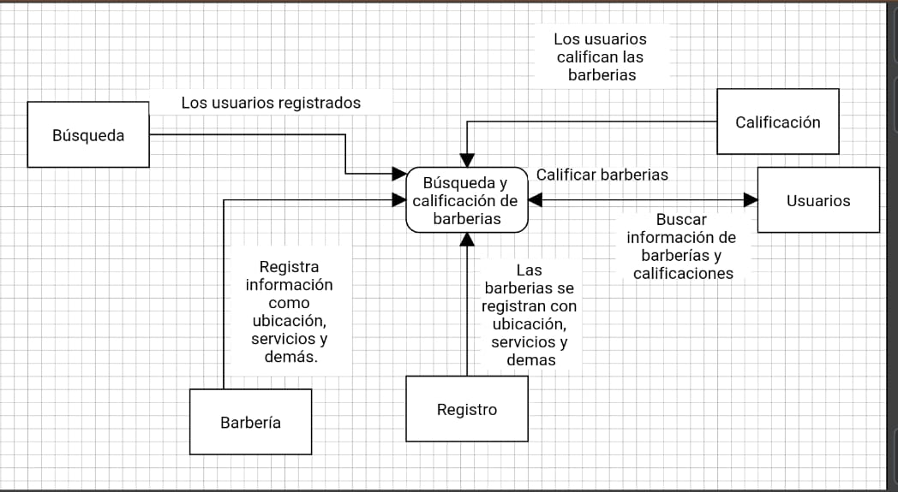

# RED BARBER
## Integrantes
* Felipe Varela
* Santiago Cortes
* Carlos Rios  
* Santiago Cardona 

## Planteamiento del problema
* Cuando se busca un lugar para realizar un corte de cabello o servicios afines, no se encuentran referencias, información de contacto, información de los servicios y los comentarios acerca de los establecimientos, además no se pueden comparar dichos lugares para hacerse los cortes.

## Descripción del proceso actual
* El proceso actual que hacen las personas a la hora de buscar referencias de una barbería se hacen por medio de redes sociales, esta información no es confiable y no se puede comparar con otras barberías.

## Justificación
*  El proyecto se enfocara en mejorar la búsqueda de barberías en la ciudad de Medellín debido a que las barberías no tienen un sitio donde registrar su información para poder ser visible a los clientes, también dichos clientes no tienen un sitio donde comparar los servicios que ofrecen las barberías en Medellín y consultar su información.

## Descripción de la propuesta
*  Desarrollar un aplicativo web para facilitar la búsqueda de barberías donde se pueda ver su información de contacto, sus servicios para que los clientes puedan comparar y tener más opciones a la hora de elegir. Además el sistema permitirá hacer comentarios a los establecimientos.

## Diagrama de contexto

### Observaciones Entregable Uno.
- Más orden al momento de presentar la idea.
- Contextualizar mejor el problema, respaldar con algunas cifras y necesidades puntuales.
- Dominio del tiempo, la idea es ser claro y específico en el tiempo proporcionado.
- Respecto al tablero, orientarlo más a la actividad a realizar (ventanas).
- La nota aca proporcionada es 0.5 menos a aquellas personas que no estuvieron el día de la presentación.

#### Nota: 4,1

