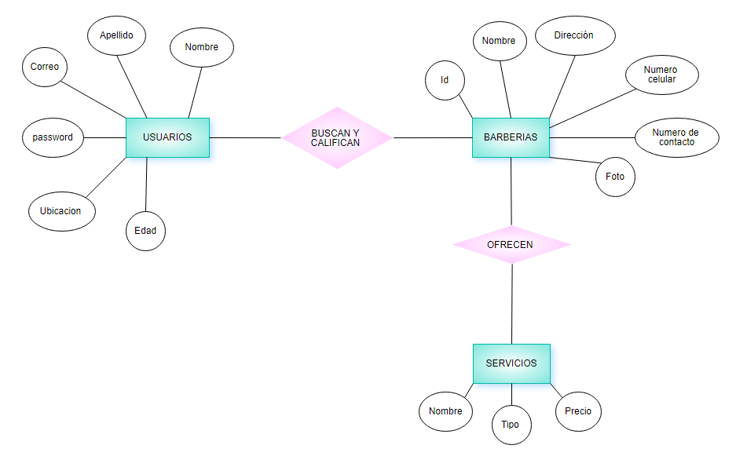

# RED BARBER
=====================================================

## Diagrama de Clase
----------------------------------------------------
En el diagrama de clases se muestran tres diferentes clases como lo son: Cliente, barbería y servicio. En la clase cliente se muestran diferentes datos que el aplicativo guarda como lo son el nombre, apellidos, contraseña, ubicación y edad. Los cuales son requeridos para iniciar sesión en el aplicativo, para poder realizar búsquedas y para calificar las barberías. Otra clase que se muestra es la de barbería, esta clase tiene diferentes datos como lo son ID, Nombre, Número de contacto, Dirección y foto. Todos estos datos son requeríos para permitir que los usuarios puedan realizar búsquedas de las barberías .Por último esta la clase de servicios la cual está directamente relacionado con la clase barbería ya que las barberías tienen o prestan servicios y los datos que tiene esta clase son nombre, tipo y precio. Los cuales son necesarios para realizar búsquedas.

## Diagrama Entidad Relacion (E-R)
-------------------------------------------------------
En el diagrama entidad relación se muestran las siguientes tres entidades como los son la clase de usuarios, la de barberías y la de servicios. La clase clientes como se muestra en el diagrama  hace consultas y califica a las barberías. Y todo esto requiere ciertos datos en la entidad usuario como lo son el nombre, apellidos, contraseña, ubicación y edad. En la entidad barbería se relaciona directamente con los servicios dado que las barberías prestan servicios y para las barberías se requieren ciertos datos como los son ID, Nombre, Número de contacto, Dirección y foto.  Dado que la entidad servicios está directamente relacionada con barbería necesitan algunos datos y son: nombre, tipo y precio.

